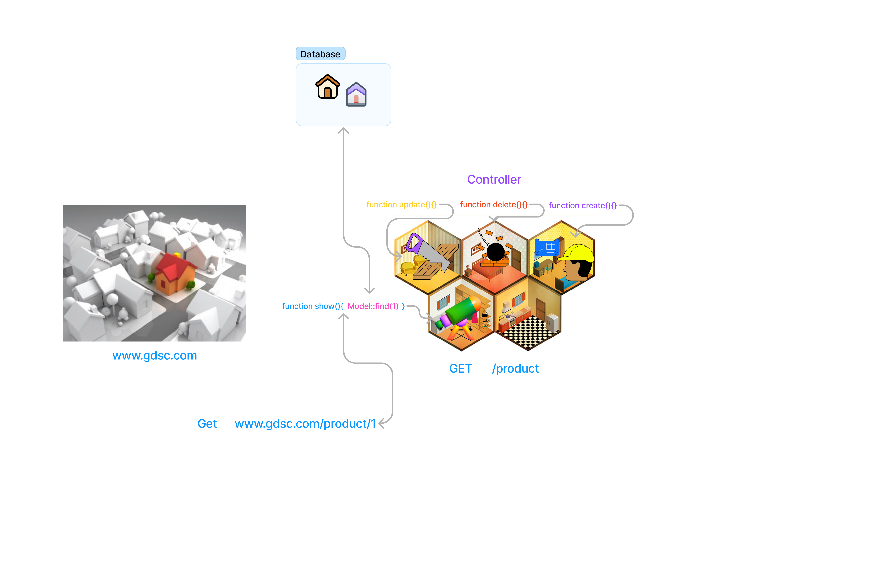
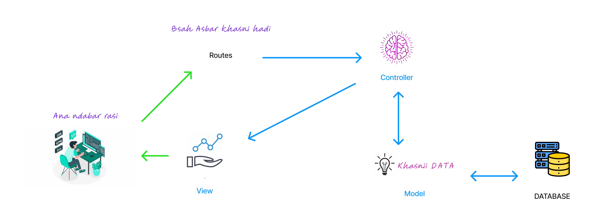
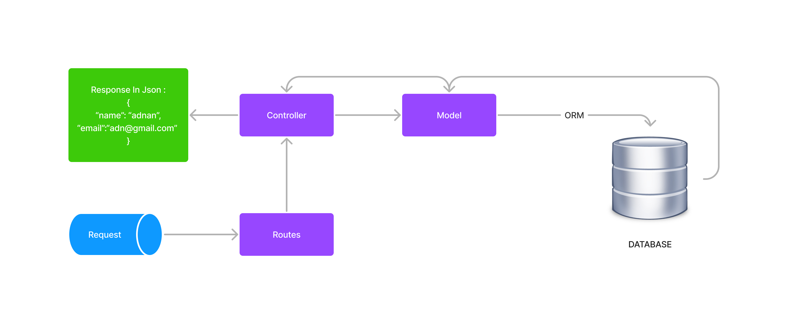
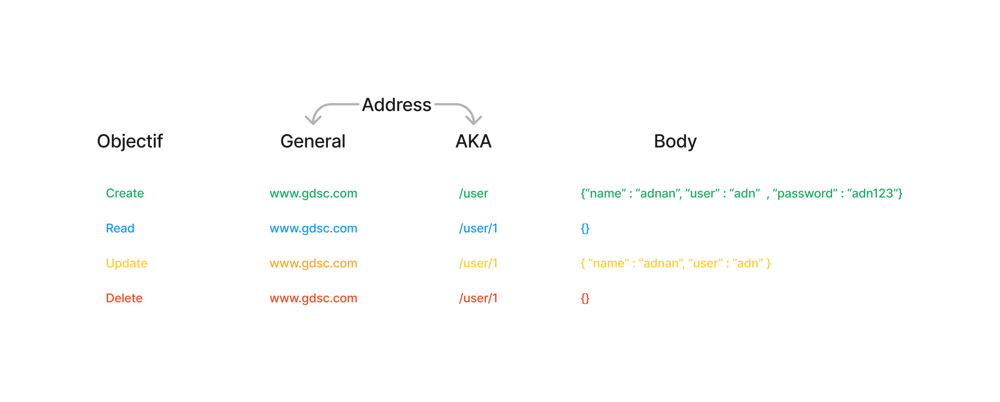

# API explecation with slides

# How to use this repository 
#### you must have git installed in your machine 
#### open git bash with the right-click 
#### enter this command-> git clone https://github.com/its4dn4n/web_bootcamp_api.git
#### after the download is completed 
#### go inside the web_bootcamp_api/src folder and open terminal 
#### enter this command to install the needed package missed when the passage through github 
#### -> composer update 
#### now you ready enjoyy ^^
